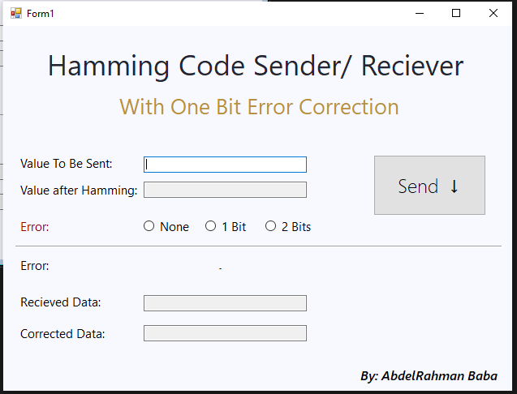

# Hamming Code Simulator

This app simulate data transition with hamming code error correction techniche
it recives any number of bits as input and add hamming bits and send it with abilty to add random error during the transition and correct it in the reciever side 

# Screenshot

